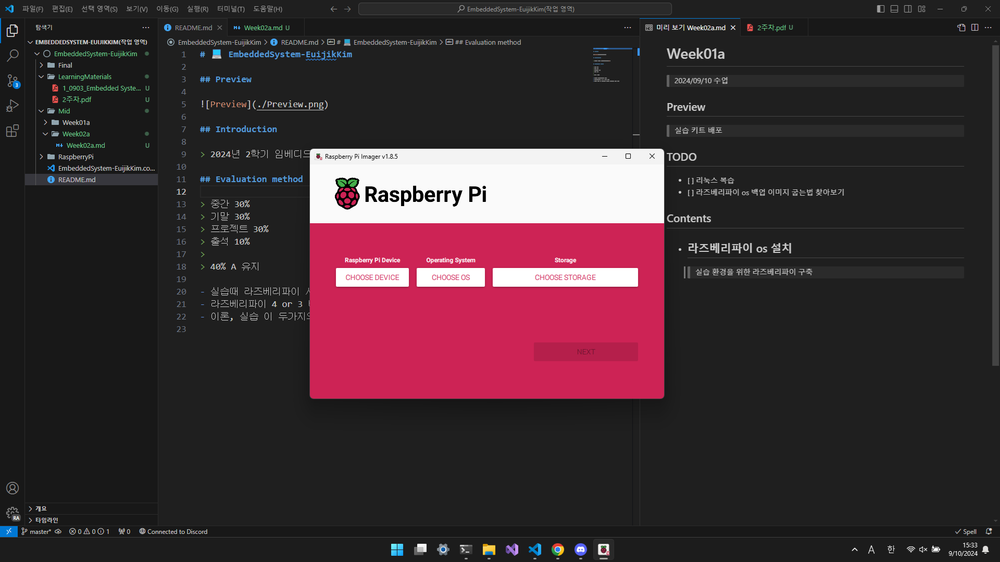

# 💻 EmbeddedSystem-EuijikKim

## Preview

## Introduction

> 2024년 2학기 임베디드시스템[01]

## Evaluation method

> 중간 30%  
> 기말 30%  
> 프로젝트 30%  
> 출석 10%  
>  
> 40% A 유지  

- 실습때 라즈베리파이 사용  
- 라즈베리파이 4 or 3 버전 배포  
- 이론, 실습 이 두가지의 수업은 연결성이 높지 않다  
